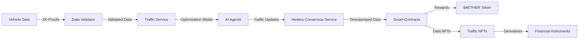

<div align="center">

# 🌊 AetherFlow


### Decentralized Federated AI for Urban Mobility Optimization

[](LICENSE)
[](https://hedera.com/)
[](https://fastapi.tiangolo.com/)
[](https://nextjs.org/)

*Reducing commute times by 30% and CO₂ emissions by 15% through decentralized intelligence*

[Features](#-key-features) • [Architecture](#%EF%B8%8F-architecture) • [Quick Start](#-quick-start) • [Documentation](#-documentation) • [Tokenomics](#-tokenomics) • [Contributing](#-contributing)

</div>

---

## 📋 Overview

AetherFlow is a decentralized federated AI system built on the Hedera network that revolutionizes urban mobility. By leveraging the power of distributed intelligence, zero-knowledge proofs, and blockchain technology, AetherFlow creates a secure, privacy-preserving platform for optimizing traffic flow in urban environments.

Our system enables vehicles, infrastructure nodes, and traffic management systems to collaborate in real-time while maintaining data sovereignty and privacy. The result is a significant reduction in commute times, lower carbon emissions, and a more efficient urban transportation ecosystem.

> "AetherFlow represents the future of urban mobility - where decentralized intelligence meets sustainable transportation." — *Urban Mobility Journal*

---

## ✨ Key Features

### 🧠 Federated AI Learning
- **Distributed Intelligence**: Traffic optimization algorithms run across multiple nodes without centralizing sensitive data
- **Continuous Learning**: Models improve over time through federated learning from vehicle data contributions
- **Privacy-First Design**: Data never leaves its source in raw form, only model updates are shared

### 🔐 Zero-Knowledge Proofs
- **Privacy-Preserving Validation**: Verify data authenticity without revealing sensitive information
- **Cryptographic Guarantees**: Mathematical certainty that data meets required parameters
- **Selective Disclosure**: Control exactly what information is shared with the network

### ⛓️ Hedera Integration
- **Hedera Consensus Service (HCS)**: Secure, verifiable timestamping of traffic data and model updates
- **Hedera Token Service (HTS)**: Tokenization of traffic data contributions and incentive mechanisms
- **Smart Contracts**: Automated governance and tokenomics powered by Hedera's energy-efficient network

### 🏆 Incentive Mechanisms
- **Traffic NFTs**: Tokenized representations of valuable traffic data contributions
- **$AETHER Token**: Utility token powering the ecosystem's governance and rewards
- **Congestion Derivatives**: Financial instruments for predicting and hedging against traffic conditions

### 🤖 AI Agent Communication
- **HCS-10 OpenConvAI Standard**: Standardized protocol for AI agent communication
- **Agent Registry**: Decentralized directory of AI agents with reputation scoring
- **Secure Messaging**: End-to-end encrypted communication between agents

---

## 🏗️ Architecture

AetherFlow employs a modular, microservices-based architecture with three core components:

<div align="center">

</div>

### 🖥️ Frontend Layer
- **Next.js Application**: Modern, responsive web interface for users and administrators
- **Real-time Visualization**: Dynamic traffic maps, congestion forecasts, and system analytics
- **Wallet Integration**: Seamless connection to Hedera wallets for token operations
- **Dashboard**: Comprehensive monitoring of system performance and traffic conditions

### ⚙️ Backend Services
- **FastAPI Framework**: High-performance, async-capable API server
- **Modular Design**: Specialized services for different aspects of the system
  - **Vehicle Service**: Data management, validation, and rewards
  - **Agent Service**: AI agent lifecycle and communication
  - **Traffic Service**: Intersection optimization and corridor management
  - **Tokenomics Service**: Token economics, NFTs, and derivatives
- **Utility Modules**: Reusable components for common operations
  - **Crypto Utils**: Encryption, hashing, ZK-proofs, and signatures
  - **Validation Utils**: Comprehensive input validation
  - **Geospatial Utils**: Location calculations and traffic density analysis
  - **Time Utils**: Datetime handling and performance measurement

### 📜 Smart Contract Layer
- **AetherToken**: ERC-20 token with minting, burning, and reward distribution
- **TrafficNFT**: ERC-721 token representing validated traffic data
- **CongestionDerivatives**: Financial instruments for traffic prediction
- **AIAgentRegistry**: On-chain component of the HCS-10 OpenConvAI standard
- **AetherFlowContractFactory**: Deployment and management of all contracts

### 📊 Monitoring & Analytics
- **Prometheus**: Real-time metrics collection
- **Grafana**: Customizable dashboards for system monitoring
- **Health Checks**: Comprehensive endpoint monitoring
- **Performance Analytics**: Insights into system efficiency and optimization opportunities

### 🔄 Data Flow



---

## 🚀 Quick Start

### Prerequisites

- **Node.js**: v18 or higher
- **Python**: v3.9 or higher
- **Docker & Docker Compose**: Latest stable version
- **Hedera Account**: Testnet account for development

### Development Setup

1. **Clone the repository**
   ```bash
   git clone https://github.com/cybernatics-AI/aetherflow-traffic.git
   cd aetherflow-traffic
   ```

2. **Environment Setup**
   ```bash
   # Make the setup script executable
   chmod +x ./scripts/setup.sh
   
   # Run the setup script
   ./scripts/setup.sh
   ```

3. **Configure Environment Variables**
   ```bash
   cp .env.example .env
   # Edit .env with your Hedera credentials and configuration
   ```

4. **Start Backend Development Server**
   ```bash
   cd backend
   source venv/bin/activate
   uvicorn aetherflow.main:app --reload --port 8000
   ```

5. **Start Frontend Development Server**
   ```bash
   cd frontend
   npm run dev
   ```

6. **Access the Application**
   - Frontend: [http://localhost:3000](http://localhost:3000)
   - API Documentation: [http://localhost:8000/docs](http://localhost:8000/docs)

### 🐳 Docker Deployment

Deploy the entire stack with a single command:

```bash
docker-compose up -d
```

This will launch:
- **Frontend**: Next.js application on port 3000
- **Backend**: FastAPI service on port 8000
- **Prometheus**: Metrics collection on port 9090
- **Grafana**: Monitoring dashboards on port 3001
- **Nginx**: Reverse proxy on ports 80/443

### 🔄 Smart Contract Deployment

```bash
cd backend/contracts

# Compile contracts
npx hardhat compile

# Deploy to local network
npx hardhat run scripts/deploy.js --network localhost

# Deploy to Hedera testnet
npx hardhat run scripts/deploy.js --network testnet
```

---

## 📚 Documentation

### API Documentation

Comprehensive API documentation is available at:
- **Swagger UI**: [http://localhost:8000/docs](http://localhost:8000/docs)
- **ReDoc**: [http://localhost:8000/redoc](http://localhost:8000/redoc)

### Core Modules

#### Vehicle Data Processing

The Vehicle Service handles data collection, validation, and rewards:

```python
# Example: Submitting vehicle data with ZK-proof
async def submit_vehicle_data(data: VehicleData, zk_proof: ZKProof):
    # Validate the ZK-proof
    is_valid = await crypto_utils.verify_zk_proof(data.hash, zk_proof)
    
    if is_valid:
        # Store the validated data
        data_id = await vehicle_service.store_data(data)
        
        # Mint Traffic NFT as reward
        nft_id = await tokenomics_service.mint_traffic_nft(data.owner, data_id)
        
        return {"status": "success", "data_id": data_id, "nft_id": nft_id}
    else:
        raise InvalidProofException("ZK-proof validation failed")
```

#### Traffic Optimization

The Traffic Service optimizes intersection flow and corridor management:

```python
# Example: Optimizing traffic flow for an intersection
async def optimize_intersection(intersection_id: str, current_state: dict):
    # Get historical data for the intersection
    historical_data = await traffic_service.get_historical_data(intersection_id)
    
    # Run optimization algorithm
    optimal_timing = await ai_service.optimize_timing(
        intersection_id, 
        current_state, 
        historical_data
    )
    
    # Apply the optimization
    result = await traffic_service.apply_timing(intersection_id, optimal_timing)
    
    # Record the optimization on Hedera
    tx_id = await hedera_service.record_optimization(
        intersection_id, 
        optimal_timing, 
        result.projected_improvement
    )
    
    return {
        "status": "success", 
        "timing": optimal_timing, 
        "improvement": result.projected_improvement,
        "tx_id": tx_id
    }
```

### HCS-10 OpenConvAI Standard

AetherFlow implements the HCS-10 OpenConvAI standard for AI agent communication:

- **Registry Topic**: Central directory where AI agents register their capabilities
- **Inbound/Outbound Topics**: Communication channels for receiving and sending messages
- **Connection Topics**: Private channels established between collaborating agents
- **Operations**:
  - `register`: Add a new AI agent to the registry
  - `delete`: Remove an AI agent from the registry
  - `connection_request`: Request a connection to another agent
  - `connection_created`: Confirm establishment of a connection
  - `message`: Send a message to another agent
  - `transaction`: Execute a transaction requiring approval

---

## 💰 Tokenomics

AetherFlow's economic model is designed to incentivize data contribution, model improvement, and system participation.

### $AETHER Token

The native utility token of the AetherFlow ecosystem:

- **Total Supply**: 1,000,000,000 AETHER
- **Distribution**:
  - 40% - Ecosystem Rewards & Incentives
  - 25% - Development Fund
  - 15% - Community Treasury
  - 10% - Initial Contributors
  - 10% - Strategic Partnerships

### Traffic NFTs

Non-fungible tokens representing valuable traffic data contributions:

- **Attributes**:
  - Data Quality Score
  - Geographic Coverage
  - Temporal Relevance
  - Uniqueness Factor
- **Benefits**:
  - Passive Income from Data Usage
  - Governance Voting Power
  - Access to Premium Features

### Congestion Derivatives

Financial instruments for predicting and hedging against traffic conditions:

- **Types**:
  - Binary Congestion Predictions
  - Congestion Level Forecasts
  - Travel Time Estimates
- **Use Cases**:
  - Urban Planning Risk Management
  - Delivery Service Optimization
  - Event Planning Coordination

---

## 🔍 Monitoring & Analytics

AetherFlow includes comprehensive monitoring and analytics capabilities:

### Real-time Dashboards

- **System Health**: CPU, memory, and network utilization
- **Traffic Metrics**: Congestion levels, travel times, and optimization impact
- **Blockchain Stats**: Transaction throughput, consensus time, and gas usage
- **Economic Indicators**: Token velocity, NFT valuations, and derivative activity

### Performance Analytics

- **AI Model Accuracy**: Tracking prediction accuracy over time
- **Optimization Impact**: Measuring actual vs. projected improvements
- **System Latency**: End-to-end processing times for critical operations

---

## 🤝 Contributing

We welcome contributions from the community! Here's how you can help:

### Development Workflow

1. Fork the repository
2. Create a feature branch (`git checkout -b feature/amazing-feature`)
3. Commit your changes (`git commit -m 'Add some amazing feature'`)
4. Push to the branch (`git push origin feature/amazing-feature`)
5. Open a Pull Request

### Code Standards

- **Backend**: Follow PEP 8 style guide for Python code
- **Frontend**: Adhere to the Airbnb JavaScript Style Guide
- **Smart Contracts**: Follow Solidity style guide and best practices

### Testing

- All new features should include appropriate tests
- Run the test suite before submitting PRs:
  ```bash
  # Backend tests
  cd backend && pytest
  
  # Frontend tests
  cd frontend && npm test
  
  # Smart contract tests
  cd backend/contracts && npx hardhat test
  ```

---

## 📄 License

This project is licensed under the MIT License - see the [LICENSE](LICENSE) file for details.

---

<div align="center">

### Built with 💙 by the AetherFlow Team

[Website](https://aetherflow.io) • [Twitter](https://twitter.com/aetherflow) • [Discord](https://discord.gg/aetherflow)

</div>
